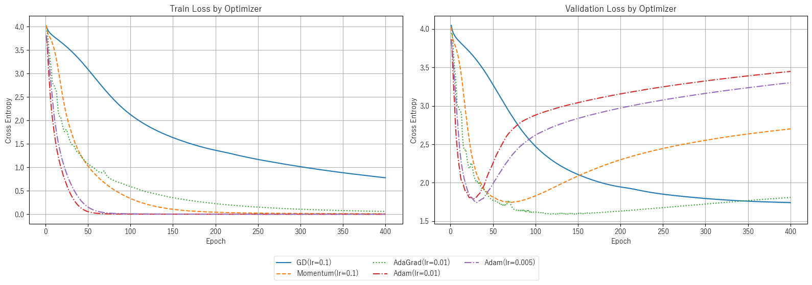
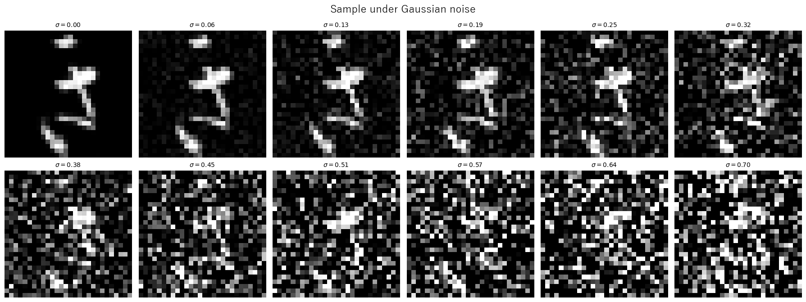

# Trabajo Práctico 3: Redes Neuronales y Deep Learning

**I302 - Aprendizaje Automático y Aprendizaje Profundo**

*Agustín A. Pereyra*

---

## Descripción

El trabajo consiste en la implementación *from scratch* de una Red Neuronal Multicapa (MLP) para clasificación multiclase, junto con la implementación de distintos optimizadores de gradiente. Se aplica el modelo al dataset **Kuzushiji-49 (K49)**, un subconjunto del dataset Kuzushiji-MNIST compuesto por imágenes de 28×28 píxeles de caracteres japoneses con 49 clases distintas.


El objetivo es explorar el efecto de distintos hiperparámetros de entrenamiento (batch size, optimizador, learning rate scheduling, weight decay, dropout, entre otros) mediante experimentos sistemáticos, y comparar el modelo propio contra una implementación equivalente en **PyTorch**.



Finalmente se analizan los modelos ante perturbaciones (gaussianas) de los datos estudiando así la robustez de cada modelo para diferentes niveles de perturbaciones.



#### Estructura de Directorios

```text
├── data/
│   ├── X_images.npy        # imágenes del dataset
│   └── y_images.npy        # labels del dataset
├── figures/                # figuras del DOCSTRING
├── results/                # CSVs de grid search guardados por experimento
├── src/
│   ├── __init__.py
│   ├── activations.py      # funciones de activación y sus derivadas
│   ├── metrics.py          # métricas de desempeño (accuracy, F1-macro, cross-entropy, confusion matrix)
│   ├── model_selection.py  # funciones para tests y análisis de modelos
│   ├── models.py           # implementación from scratch de la MLP (clase NN)
│   ├── optimizers.py       # optimizadores: GD, Momentum, AdaGrad, Adam, AdamW
│   ├── plots.py            # funciones graficadoras
│   ├── torch_models.py     # MLP equivalente implementada en PyTorch (clase TorchNN)
│   └── utils.py            # utilidades varias (one-hot encoding, labels K49, paths, etc)
│
├── Entrega_TP3.ipynb       # notebook principal
├── README.md
└── requirements.txt        # dependencias
```

#### Dependencias

Para instalar todas las dependencias del trabajo se requiere ejecutar el siguiente comando para un envirounment de conda:

```bash
conda install --file requirements.txt
```
